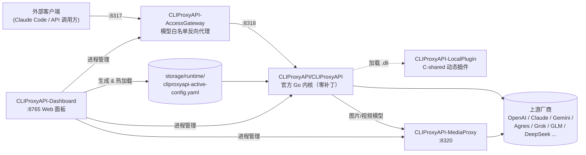

# CLIProxyAPI_work

多提供商 LLM/多模态代理工作区：官方 [CLIProxyAPI](https://github.com/router-for-me/CLIProxyAPI) 内核保持零补丁纯粹，本地扩展（网关、插件、媒体代理、Web 面板）全部在内核外层实现。

## 目录

- [背景](#背景)
- [架构总览](#架构总览)
- [模块速览](#模块速览)
- [快速开始](#快速开始)
- [端口一览](#端口一览)
- [配置体系](#配置体系)
- [更新官方内核](#更新官方内核)
- [文档地图](#文档地图)
- [安全](#安全)
- [贡献](#贡献)
- [License](#license)

## 背景

上游 `router-for-me/CLIProxyAPI` 是一个 Go 编写的多提供商 LLM 代理内核，负责把 OpenAI / Claude / Gemini / Codex 等风格的请求转发给不同厂商。本工作区在内核**外层**叠加了四类本地能力：

1. 面向局域网/远端的**模型白名单网关**（只暴露映射后的别名，隐藏原始上游模型名）
2. 一个 **Go C-shared 动态插件**，用来做内核不提供的请求适配（如 Agnes 的 `enable_thinking` 参数）
3. 一个独立的**图片/视频代理**，把媒体模型路由从文本代理核心里剥离出来
4. 一个 **Python Dashboard 控制面 + Web UI**，用于生成运行态配置、管理进程生命周期、查看请求日志；Tauri GUI 作为它的桌面宿主

这样做的原因写在 [AGENTS.md](AGENTS.md) 里，核心是"内核纯粹"原则：不侵入修改 `CLIProxyAPI/CLIProxyAPI/` 里的官方源码，升级上游版本时只需要跑一条脚本。

## 架构总览



请求路径：客户端只应该访问 **8317**（网关）。原始上游模型名只在本机 **8318**（内核）上存在，网关按 `cliproxyapi-active-config.yaml` 里声明的别名做白名单转发，未映射的模型名会被拒绝。

关于每个模块的职责边界、请求生命周期（含重试/冷却/fallback 语义）、以及为什么要用三个 Git remote 管理这个仓库，见 [docs/ARCHITECTURE.md](docs/ARCHITECTURE.md)。

## 模块速览

| 目录 | 角色 | 技术栈 | 详细文档 |
| --- | --- | --- | --- |
| `CLIProxyAPI/CLIProxyAPI/` | 官方代理内核（严禁改动源码） | Go | [上游文档](CLIProxyAPI/CLIProxyAPI/README_CN.md) |
| `CLIProxyAPI/` | 内核的本地运行目录（config + storage + 启动脚本） | PowerShell | [CLIProxyAPI/README.md](CLIProxyAPI/README.md) |
| `CLIProxyAPI-AccessGateway/` | 模型白名单反向代理，对外唯一入口 | Go | [CLIProxyAPI-AccessGateway/README.md](CLIProxyAPI-AccessGateway/README.md) |
| `CLIProxyAPI-LocalPlugin/` | 内核外的请求适配插件（C-shared DLL） | Go + Zig(CGO) | [CLIProxyAPI-LocalPlugin/README.md](CLIProxyAPI-LocalPlugin/README.md) |
| `CLIProxyAPI-MediaProxy/` | 独立的图片/视频生成代理 | Go | [CLIProxyAPI-MediaProxy/README.md](CLIProxyAPI-MediaProxy/README.md) |
| `CLIProxyAPI-Dashboard/` | 唯一 Web 管理面与控制 API（配置、进程、日志） | Python + 原生 Web UI | [CLIProxyAPI-Dashboard/README.md](CLIProxyAPI-Dashboard/README.md) |
| `apps/tauri-gui/` | Dashboard 的 Tauri Windows 桌面宿主 | Rust + Tauri | [apps/tauri-gui/README.md](apps/tauri-gui/README.md) |
| `PortBindingTools/` | Windows portproxy + 防火墙规则管理 | PowerShell | [PortBindingTools/README.md](PortBindingTools/README.md) |
| `start.ps1` | GUI 与 Web Dashboard 的统一入口 | PowerShell | 本文档 |
| `update-core.ps1` | 一键同步官方内核到指定 Tag | PowerShell | [更新官方内核](#更新官方内核) |

## 快速开始

推荐从工作区根目录启动。GUI 和 Web Dashboard 使用同一个 `CLIProxyAPI/storage/` 数据目录：

```powershell
.\start.ps1 -Mode GUI
```

```powershell
.\start.ps1 -Mode Dashboard -OpenBrowser
```

首次开发启动 Dashboard 时，复制 `CLIProxyAPI-Dashboard/.env.example` 为 `.env`。统一入口会为当前进程固定 `CLIPROXYAPI_ROOT` 与 `CLIPROXYAPI_STORAGE_DIR`，避免 GUI 误连其他工作区或写入系统缓存。

仅需要裸代理、不使用面板时：

```powershell
cd E:\U_App\CLIProxyAPI_work\CLIProxyAPI
.\start.ps1 build       # 编译 CLIProxyAPI\bin\cli-proxy-api.exe
.\start.ps1 codex       # 使用 storage\config\base-config.yaml 启动（无网关白名单）
```

`start.ps1 codex` 模式不经过 `CLIProxyAPI-AccessGateway`，仅用于本地调试上游内核本身；对外服务请使用面板模式。

## 端口一览

| 端口 | 组件 | 说明 |
| --- | --- | --- |
| `8317` | `CLIProxyAPI-AccessGateway` | 唯一对外入口，只转发白名单别名 |
| `8318` | `CLIProxyAPI/CLIProxyAPI`（内核） | 仅本机监听，暴露全部原始上游模型 |
| `8320` | `CLIProxyAPI-MediaProxy` | 图片/视频生成，内核按模型规则转发到这里 |
| `8765` | `CLIProxyAPI-Dashboard` | Web 面板默认端口，可用 `CLIPROXYAPI_DASHBOARD_PORT` 覆盖 |

需要局域网/远端访问某个端口时用 `PortBindingTools/set-port-bindings.ps1`，它只处理 TCP（UDP 端口如 SSDP `1900` 无法通过 Windows portproxy 暴露）。

## 配置体系

配置分三层，字段说明、路由/重试/冷却语义、常见排错见 [docs/CONFIGURATION.md](docs/CONFIGURATION.md)：

| 文件 | 用途 |
| --- | --- |
| `CLIProxyAPI/CLIProxyAPI/config.example.yaml` | 上游内核自带的字段说明模板，不会被程序读取 |
| `CLIProxyAPI/storage/config/base-config.yaml` | 手写的基础配置，`start.ps1 codex` 使用 |
| `CLIProxyAPI/storage/runtime/cliproxyapi-active-config.yaml` | 面板生成的运行态配置，`start.ps1 dashboard` 和面板启动的进程使用，**不要手工长期维护**，改动会被面板覆盖 |

## 更新官方内核

```powershell
.\update-core.ps1                          # 更新到最新 v7 标签
.\update-core.ps1 -TargetVersion v7.2.128  # 或指定版本
```

脚本从 `upstream-cpa` remote（`router-for-me/CLIProxyAPI`）拉取指定 Tag，用 `robocopy /MIR` 把源码镜像到 `CLIProxyAPI/CLIProxyAPI/`，依次编译验证内核、插件、MediaProxy、Dashboard，全部通过后才更新 `UPSTREAM_VERSION`。本地功能永远维护在插件/面板层，不会以内核补丁形式存在，因此这一步理论上不会产生合并冲突。

## 文档地图

- [AGENTS.md](AGENTS.md) — 代码改动的行为准则（简洁优先、外科手术式改动、内核纯粹原则）
- [docs/ARCHITECTURE.md](docs/ARCHITECTURE.md) — 模块职责边界、请求生命周期、Git remote 策略
- [docs/CONFIGURATION.md](docs/CONFIGURATION.md) — 配置文件字段参考、端口/路由/重试/冷却语义、常见报错排查
- [docs/CONTRIBUTING.md](docs/CONTRIBUTING.md) — 提交规范、版本发布流程、测试要求
- [CHANGELOG.md](CHANGELOG.md) — 版本历史（Keep a Changelog + SemVer）
- [SECURITY.md](SECURITY.md) — 凭据存储现状、风险与漏洞报告方式

> 本文档集对应内核版本 `UPSTREAM_VERSION`（当前 `v7.2.128`）与工作区版本 `VERSION`（当前 `1.4.0`）编写。每次 `update-core.ps1` 升级内核后，请对照 [docs/CONTRIBUTING.md#版本发布流程](docs/CONTRIBUTING.md#版本发布流程) 检查文档是否需要同步更新。

## 安全

本项目的配置文件（`storage/config/`、`storage/runtime/`）会以明文形式保存上游 API Key，均已被 `.gitignore` 排除在版本控制之外。凭据处理规范、密钥轮换建议、漏洞报告方式见 [SECURITY.md](SECURITY.md)。

## 贡献

提交前请先阅读 [docs/CONTRIBUTING.md](docs/CONTRIBUTING.md) 与 [AGENTS.md](AGENTS.md)。核心约束：**不要改动 `CLIProxyAPI/CLIProxyAPI/` 里的官方源码**，本地功能只能加在插件/网关/面板层。

## License

内核部分沿用上游 [MIT License](CLIProxyAPI/CLIProxyAPI/LICENSE)（Copyright Router-For.ME 及原作者）。本工作区新增的网关、插件、媒体代理、面板代码在 [LICENSE](LICENSE) 中声明。
