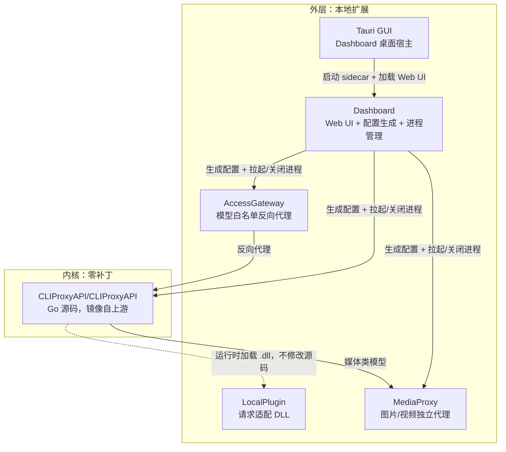

# 架构说明

> **文档版本**：对应工作区版本 `1.4.0`，内核版本 `v7.2.128`（`UPSTREAM_VERSION`）。内核升级后请检查本文档中涉及内核行为的描述是否仍然准确。
>
> 面向需要修改或扩展本工作区的开发者。使用者只需要看 [顶层 README](../README.md) 的"快速开始"。

## 目录

- [设计原则：内核纯粹](#设计原则内核纯粹)
- [模块职责边界](#模块职责边界)
- [请求生命周期](#请求生命周期)
- [失败处理：重试、冷却与 fallback 的边界](#失败处理重试冷却与-fallback-的边界)
- [Git remote 策略](#git-remote-策略)
- [目录结构](#目录结构)
- [项目维护记忆](PROJECT_MEMORY.md)

## 设计原则：内核纯粹

`CLIProxyAPI/CLIProxyAPI/` 是官方仓库 [router-for-me/CLIProxyAPI](https://github.com/router-for-me/CLIProxyAPI) 的源码镜像，**禁止在此目录内做任何手工改动**。原因：

- 上游更新频繁（本仓库当前锁定 `v7.2.128`，见 `UPSTREAM_VERSION`），一旦源码被本地修改，`update-core.ps1` 的 `robocopy /MIR` 镜像同步会直接覆盖或冲突。
- 所有二次开发被强制推到三个位置：网关（`CLIProxyAPI-AccessGateway`）、动态插件（`CLIProxyAPI-LocalPlugin`）、面板（`CLIProxyAPI-Dashboard`）。这样升级内核版本时，验证范围永远是"这三个外层组件是否还能正常编译和联动"，而不需要 diff 内核源码。

完整准则见 [AGENTS.md](../AGENTS.md)，这里只解释"为什么"。

## 模块职责边界



| 模块 | 能做什么 | 不能做什么 |
| --- | --- | --- |
| **AccessGateway** | 读取运行态配置里的所有别名，作为白名单；反向代理到内核 8318；每秒轮询配置文件变化，热更新白名单 | 不做任何请求体改写，不感知具体厂商协议 |
| **LocalPlugin** | 以 Go C-shared 插件形式运行在内核进程内，做内核不原生支持的请求适配（例如 Agnes 的 `chat_template_kwargs.enable_thinking`），暴露 `/v0/resource/plugins/cliproxy-local/status` 状态资源 | 不能替代内核的路由/鉴权逻辑，只做"补丁式"字段适配 |
| **MediaProxy** | 独立进程，按 `config.example.json` 里 `model_rules` 声明的 `type`/`endpoint`/`request_format` 转发图片/视频生成请求，支持 `agnes-image`/`agnes-video`/`openai-image`/`openai-video`/`passthrough` 五种协议适配 | 不处理文本模型，不与内核共享进程 |
| **Dashboard** | 生成 `cliproxiapi-active-config.yaml`、管理三个后端进程的启停与健康检查、暴露 Web UI，并以 `CLIProxyAPI/storage/` 为唯一数据目录 | 不直接转发业务请求，纯管理面 |
| **Tauri GUI** | 启动/回收自己创建的 Dashboard sidecar、等待 HTTP ready、提供 WebView 窗口与托盘 | 不直接编排 Core/Gateway/MediaProxy，不读写 Dashboard 私有数据 |

## 请求生命周期

以一次 `POST /v1/messages`（外部客户端携带某个别名模型名）为例：

1. 客户端请求打到 **8317**（AccessGateway）。
2. Gateway 检查请求里的模型名是否在白名单（从 `cliproxyapi-active-config.yaml` 的 `oauth-model-alias` / `openai-compatibility[].models` 等字段收集的所有 `alias`）中，不在则拒绝。
3. 通过白名单校验后，反向代理转发到 **8318**（内核）。
4. 内核按同一份配置文件里的路由规则（`routing.strategy: round-robin`），在映射到该别名的多个上游提供商条目之间选择一个转发。
5. 若目标是图片/视频类模型，内核转发给 **8320**（MediaProxy）而不是直连厂商 API。
6. 上游返回后原样透传回客户端；`request-log: true` 时内核记录请求/响应到日志供面板展示。

## 失败处理：重试、冷却与 fallback 的边界

这是本项目里最容易踩坑的一块，务必分清三层，它们各自的作用范围不同：

**CLIProxyAPI 内核层的 `request-retry`**（`storage/runtime/cliproxyapi-active-config.yaml` 里的 `request-retry: 3`）只在收到 **403 / 408 / 500 / 502 / 503 / 504** 时重试换一个凭据/上游条目。**400 不会触发重试**——如果上游返回 400（例如参数组合不被上游接受），内核直接把 400 原样透传给客户端，不会自动换节点。

**内核层的 `transient-error-cooldown-seconds`** 控制 408/500/502/503/504 类瞬时错误后，该凭据/条目进入多长的冷却期不再被路由选中；`0` 表示沿用 60 秒的历史默认值，`-1` 表示禁用冷却。这是"暂时别选它"的机制，不是"换个模型试试"的 fallback。

**上游 LiteLLM 节点自己的 `fallbacks` 配置**（如果某个 `openai-compatibility` 条目背后是一台 LiteLLM 网关）与 CLIProxyAPI 完全无关——那是 LiteLLM 服务器自己的模型级 fallback，配没配、配得对不对，只取决于那台服务器的 `config.yaml`。同一个模型名指向多台 LiteLLM 节点时，如果只有部分节点配了 fallback，会出现"同一个请求打到不同节点、结果不一样"的现象（一个 400 直接失败，另一个自动降级到别的模型返回 200）。排查这种"时好时坏"问题时，先确认请求实际落在哪个节点（看请求日志里的 upstream URL），再去对应节点的 LiteLLM 配置里查 fallback，而不是怀疑 CLIProxyAPI 本身没做重试。

## Git remote 策略

```
origin        https://github.com/<你的账号>/CLIProxyAPI_work.git   # 本仓库的主 remote，日常 push
old-origin    https://github.com/youqu117/CLIProxyAPI_work.git      # 历史 remote，保留备查
upstream-cpa  https://github.com/router-for-me/CLIProxyAPI.git      # 官方内核源，只用于 update-core.ps1 拉取 Tag
```

`upstream-cpa` 不参与日常开发分支，只在运行 `update-core.ps1` 时被拉取指定 Tag 后镜像进 `CLIProxyAPI/CLIProxyAPI/`；本仓库的提交历史里不会出现 upstream 的 merge commit，`robocopy /MIR` 的镜像结果作为一次性文件变更被提交。

## 目录结构

```
CLIProxyAPI_work/
├── CLIProxyAPI/                    # 内核运行目录
│   ├── CLIProxyAPI/                # 官方源码镜像（零补丁）
│   ├── config/                     # 内核自带的 config.example.yaml
│   ├── storage/                     # 唯一用户数据目录（Git 忽略）
│   │   ├── auth/                    # 认证凭据
│   │   ├── config/                  # 手写配置与首页本地工作台按钮
│   │   ├── logs/                    # Dashboard 与本机工具日志
│   │   ├── shortcuts/               # 仅本机使用的目录快捷方式
│   │   ├── config/base-config.yaml         # 手写基础配置
│   │   └── runtime/cliproxyapi-active-config.yaml  # 面板生成的运行态配置
│   └── scripts/                    # build-proxy / start-proxy / cleanup-storage / resolve-proxy
├── CLIProxyAPI-AccessGateway/      # 模型白名单网关（Go，独立 exe）
├── CLIProxyAPI-LocalPlugin/        # 请求适配插件（Go C-shared，独立 dll）
├── CLIProxyAPI-MediaProxy/         # 图片/视频代理（Go，独立 exe）
├── CLIProxyAPI-Dashboard/          # 唯一控制面：Python 后端 + Web UI
├── apps/tauri-gui/                 # Tauri Windows 桌面宿主
├── PortBindingTools/               # Windows portproxy/防火墙脚本
├── docs/                           # 架构、配置与贡献文档
│   └── archive/                    # 已替代的原型与历史工具，仅供参考
├── start.ps1                       # GUI、Dashboard 统一入口
├── update-core.ps1                 # 内核升级脚本
├── UPSTREAM_VERSION / VERSION       # 上游内核版本 / 本工作区版本
└── AGENTS.md / CHANGELOG.md / README.md
```
